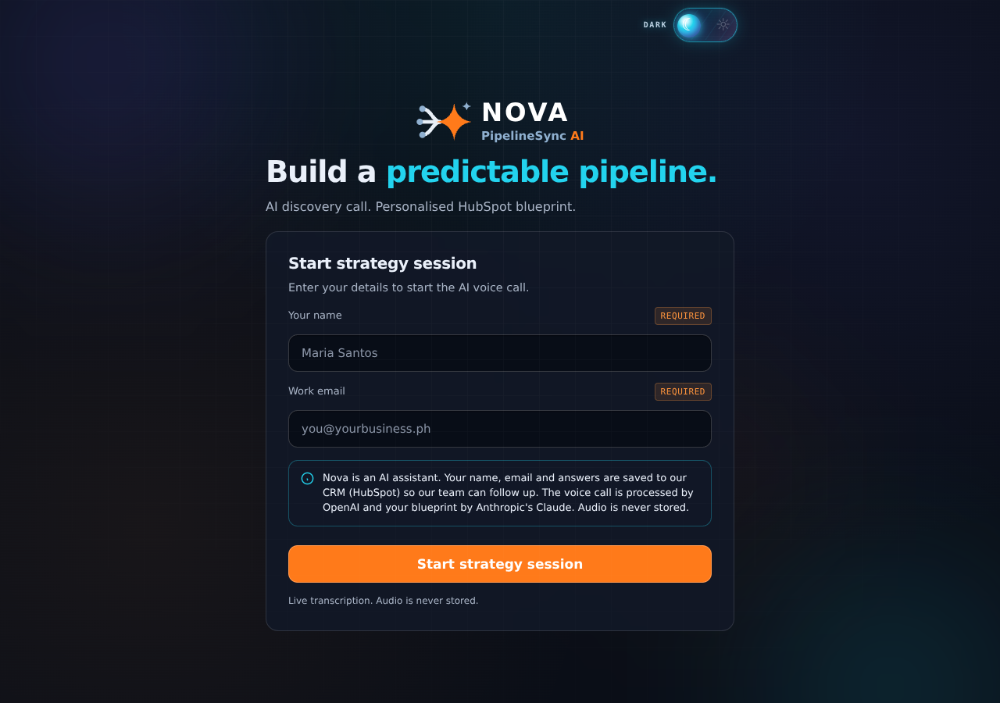
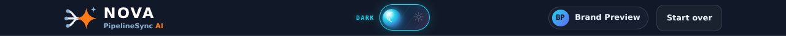
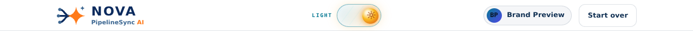
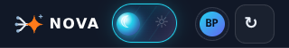
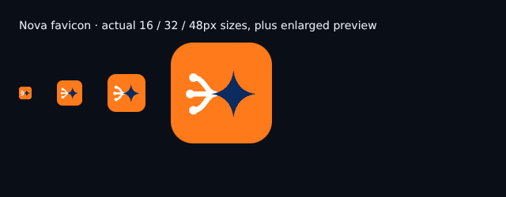

# Nova brand migration — verification and assertion audit

Date: 30 September 2026 · Branch: `arena/01a0ef68-ai`

## Delivered

- Exact supplied Nova geometry, palettes, paint order and 222:162 aspect ratio.
- Existing `LogoMark({ variant, size, animated })` and `Logo({ variant, size })` APIs retained.
- Real HTML two-line wordmark: NOVA (800, 0.09em), PipelineSync (600), orange AI (800).
- Theme-aware topbar, entry gate, loading and completion marks; permanently dark voice orb uses the dark variant. No white logo plates.
- Animated dots travel on the exact three incoming paths, then the star pulses. Reduced motion restores static dots and disables the pulse.
- All ten requested SVG/PNG/ICO assets regenerated. Orange favicon; navy app icons; maskable artwork inside the central 80%-diameter circle.
- Page/manifest/PDF/email product names updated. PDF and email headers were already text-only; no old logo was embedded in either template.
- No runtime dependencies added. `package-lock.json` unchanged. `@resvg/resvg-js` is only loaded by `scripts/make-brand-assets.js` and remains a separately installed build-time tool.
- No environment variable, API route, HubSpot property key, `pipelinesync_ai` source value, Supabase table, or existing test/export filename renamed.

The branch also includes the earlier requested voice-memory fixes, centered layouts, and discovery-sidebar removals. Their assertion migrations are recorded separately below rather than being hidden in the brand audit.

## Full suite

`npm run test:all` completed with exit code **0**. All 15 files passed; no skipped PDF validation. Counts below are the files' `PASS` records, or successful native assertions for the two assert-based files. A temporary observer collected counts without changing test conditions. PDF structural checks use their own reporting format.

| File in `test/` | Passing checks | Failures |
|---|---:|---:|
| `supabase-leads.js` | 10 | 0 |
| `voice.js` | 108 | 0 |
| `voice-memory.js` | 27 | 0 |
| `voice-openai.js` | 24 | 0 |
| `voice-realtime.js` | 257 | 0 |
| `e2e.js` | 85 | 0 |
| `pdf-email.js` | 84 | 0 |
| `netlify-sim.js` | 113 | 0 |
| `claude-pipeline.js` | 80 | 0 |
| `pdfcheck.js` | 4 PDFs; 36 xrefs + 4 trailers | 0 |
| `ui-design.js` | 150 | 0 |
| `ui-smoke.js` | 316 | 0 |
| `turnstile.js` | 17 | 0 |
| `demo-and-limits.js` | 25 | 0 |
| `consent.js` | 25 | 0 |

**Total: 1,321 passing checks plus four valid PDFs (36 cross-reference offsets and four trailers); zero failures.**

PDF files: ecommerce 8/8 xrefs, home 8/8, medical 10/10, solar 10/10; all trailers valid. Existing filenames remain unchanged.

### Additional verification

- Ran `npm run brand:icons` twice; all ten asset SHA-256 hashes remained identical.
- Browser checked both themes on entry and topbar, plus header layouts at 1280, 390 and 320px: no horizontal overflow and no logo/theme-toggle overlap.
- Browser sampled animation at 0, 800, 1540 and 2128ms. At 1540ms all three dots reached `(84,100)` in mark coordinates. Reduced-motion mode reported `animation-name: none` and restored `(16,50)`, `(6,100)`, `(16,150)`.
- `git diff --check` passed.
- Screenshot browser tooling was installed only in the local sandbox, not added to package manifests or committed. External Google Fonts were blocked for deterministic capture; screenshots use the app's system-font fallback.

### Measured mark contrast

| Foreground / surface | Ratio | Required |
|---|---:|---:|
| Light navy lines / white | 13.79:1 | 3:1 |
| Light steel dots / white | 5.83:1 | 3:1 |
| Dark mist lines / `#0A0E17` | 16.65:1 | 3:1 |
| Dark sky dots and spark / `#0A0E17` | 8.54:1 | 3:1 |
| Orange star / `#0A0E17` | 7.40:1 | 3:1 |
| Navy star / orange favicon tile | 5.29:1 | 3:1 |
| Orange star / navy app tile | 5.29:1 | 3:1 |

## Changed assertions: brand task (old → new, and why)

All entries below refer to `test/ui-design.js` unless another file is named. Existing unrelated colour thresholds, touch targets, CSS coverage, accessibility, waveform and mascot checks were retained.

| # | Old assertion | New assertion | Why |
|---:|---|---|---|
| 1 | Design-system `--navy` logo stroke contrasted with a white plate | Exact light lines `#0C2B5E` contrasted with white, still ≥3:1 | Test the specified mark colour rather than an unrelated compatibility token. |
| 2 | Design-system `--steel` logo stroke contrasted with a white plate | Exact light dots `#3E6892` contrasted with white, still ≥3:1 | Same, using the specified dot colour. |
| 3 | White logo plate contrasted with navy hero | Dark lines, dots/spark and star each contrasted directly with `#0A0E17`, each ≥3:1 | White plates were removed by request; artwork itself must be visible. |
| 4 | No inline `function logoMark()` duplicate | Same condition, description updated to “shared component” | Geometry still has one runtime owner. |
| 5 | Every hard-coded light mark is near a plate/splash call site | Theme helper must map light→light, otherwise dark; no fixed light call site on theme-following surfaces; splash must use the helper | Tests actual surface selection without the old plate heuristic. |
| 6 | Orb contains `LogoMark({variant:'dark',size:24})` | Same call, plus CSS must retain its dark orb background | Dark artwork remains correct even when the surrounding app changes theme. |
| 7 | Header always uses dark lockup at size 30 | Topbar at 40 and entry at 54 both use the theme helper | Readable two-line lockup, correct in both themes. |
| 8 | At least one `logoTile(number)` call renders a plated done mark | `logoTile(54)` remains; width calculation must be `h * 222 / 162`; variant must follow theme | Preserve the completion mark and prevent distortion. |
| 9 | `.logo-plate` must have a white background | `.logo-plate` must be transparent and shadowless | No white plate behind the new mark. |
| 10 | Hero must add extra plate separation | Splash wrapper must be transparent and shadowless | Replaces decoration-specific check with the requested no-plate loading treatment; entry is covered by #5/#7. |
| 11 | `logo-on-dark.svg` exists | It parses as XML, contains the exact Nova star, matches runtime paths/circles, and has `#0A0E17` background | Existence alone cannot rule out stale artwork. |
| 12 | Favicon contains navy fill and orange dot | Orange tile, navy star, white lines/dots, exact 22% radius, 16px lines, 13px dots, no spark, centred at 72% width | Exact specified favicon icon variant. |
| 13 | App icon has 512 viewBox and some rounded corners | Same dimensions, exact navy tile/palette, 22% radius, 16px lines, 13px dots, no spark, centred at 72% width | Exact specified navy icon variant. |
| 14 | Favicon SVG parses as XML | Same check retained, plus exact Nova star; also applied to both standalone marks and both new lockups | Every generated vector must decode. |
| 15 | App-icon SVG parses as XML | Same check retained, plus exact Nova star; extended as above | Same. |
| 16 | `icon-512.png` exists | Valid PNG signature and 512×512 IHDR | Cannot pass with a stale/non-PNG placeholder. |
| 17 | `icon-maskable-512.png` exists | Valid 512×512 PNG plus decoded artwork pixels inside the 80%-diameter safe circle, with a real orange star present | Tests the safe zone rather than mere file presence. Rounded-tile antialiasing is excluded using two premultiply/unpremultiply quantisation steps, not by relaxing the radius. |
| 18 | `apple-touch-icon.png` exists | Valid PNG signature and 180×180 IHDR | Pin the requested iOS asset size. |
| 19 | Source regex checks old 440×590 viewBox, 55px strokes and orange rectangle | Render both variants and assert exact `-10 16 222 162` viewBox, 222:162 scaling, all three 14px round-capped line paths, all dot centres/radii, exact star/spark paths and paint order | Replace—not delete—the previous geometry checks. |
| 20 | Source contains navy/steel/white colour literals | Rendered light and dark variants must match their complete exact line/dot/star/spark palettes | Checking used attributes is stronger than finding unused colour strings. |
| 21 | Source regex checks SVG `role=img` / aria-label | Rendered SVG in each variant must expose `role=img` / full product name; HTML lockup must also expose the full name | Keep accessible naming while adding the real-text lockup. |
| 22 | Source contains a reduced-motion media query | Both flow dots and pulse star must have animation disabled; dot offset paths disabled and original positions restored | A media query alone does not prove both animations stop. |

### Newly added brand assertions (no old assertion removed)

1. Both icon star/tile contrast pairs must be ≥3:1.
2. Both HTML lockups contain real `NOVA` and `PipelineSync AI` text and correct surface-specific text colours.
3. NOVA weight 800 / spacing 0.09em, subline weight 600, AI orange and weight 800.
4. Exactly three flow dots use the specified incoming paths; the star uses the gentle pulse animation.
5. All six generated vectors contain the exact star; standalone light/dark paths and circles equal their runtime counterparts.
6. Both new static lockups contain exactly the two requested text lines.
7. ICO directory includes three 16/32/48 entries with PNG signatures.
8. Manifest full name is `Nova PipelineSync AI` and short name is `Nova` (existing theme-colour/512-icon checks retained unchanged).
9. Asset/browser tooling must not enter application runtime dependencies; resvg must not become an app dev dependency either.
10. Page title, browser PDF header, server PDF header and email header use the full product name.

## Earlier session assertion migrations included in this branch

These correspond to the user's prior requests to rename the product, hide the four discovery sidebar cards, preserve conversational history internally, and center the UI. This table records every changed assertion in those files against the branch base. Unchanged conditions are not presented as new tests.

### `test/ui-smoke.js`

| Old | New | Why |
|---|---|---|
| Entry SVG aria-label `PipelineSync AI` | `Nova PipelineSync AI` | Earlier requested product rename. |
| Topbar SVG aria-label `PipelineSync AI` | `Nova PipelineSync AI` | Same. |
| Browser-mode badge visible | Sidebar badge absent; existing exact `#call-mode` header assertion retained | Requested Mode card removal, not mode removal. |
| ≥12 `.bubble.user` elements after spoken intake | ≥12 internal user transcript entries | Hidden transcript still retains every spoken answer. |
| ≥12 `.bubble.ai` elements | ≥12 internal AI transcript entries | Same for replies. |
| Transcript details exists and is collapsed | Transcript card absent | Requested Transcript removal. |
| ≥15 filled sidebar chips | Sidebar chips absent **and** internal captured count ≥15 | Preserve the original capture threshold without the visible card. |
| “Required numbers captured” visible after intake | Internal missing-required list is empty | Preserve capture completeness without the requirements card. |
| Blocked-microphone transcript remains collapsed | Transcript remains absent | Card removal also applies to typed fallback. |
| ≥12 typed `.bubble.user` elements | ≥12 internal user transcript entries | Preserve typed-answer history. |
| FAQ/stop checks read AI bubble text | Same FAQ and stop assertions read internal AI transcript text | Only the data source changes; content checks are unchanged. |
| ≥5 filled chips after reload | Internal captured count ≥5, plus no restored signals card | Preserve reload capture threshold. |
| “Needed for blueprint” visible after reload | Requirements and Transcript cards absent; internal missing-required count >0 | Preserve detection of missing data without restoring removed cards. |

### `test/voice-openai.js`

| Old | New | Why |
|---|---|---|
| Step-by-step badge visible | Sidebar badge absent; existing exact header-mode check retained | Requested Mode removal. |
| ≥12 user bubbles | ≥12 internal user transcript entries | Requested Transcript removal, same history threshold. |
| ≥15 filled chips | Internal captured count ≥15 | Requested signals removal, same capture threshold. |

### `test/voice-realtime.js`

| Old | New | Why |
|---|---|---|
| Full-call live badge visible | Sidebar badge absent; existing exact header live label retained | Mode card removed, not live mode. |
| ≥12 user bubbles in full call | ≥12 internal user transcript entries | Transcript card removed, not history. |
| ≥1 ignored user bubble | ≥1 internal user entry flagged ignored | Preserve off-topic grounding behaviour. |
| ≥15 filled chips (`filled`) | Internal captured count ≥15 | Same threshold, card-independent source. |
| Required-numbers success text | Missing-required list empty | Preserve completeness check internally. |
| Connection element visible in live controls | Connection element absent; headings contain neither Mode nor Captured signals | Removed UI must stay removed. |
| ≥1 user bubble in health scenario | ≥1 internal user entry | Preserve pre-fallback history. |
| Live badge before disconnect | Badge absent plus live state true and exact live header label | Preserve live-mode semantics. |
| Live badge during transient disconnect | Badge absent plus live state true and exact live header label | Preserve grace-period behaviour. |
| Connection element says reconnecting | Element absent plus internal connection state `disconnected` | Preserve health tracking without removed UI. |
| Connection element says connected after recovery | Element absent plus internal connection state `connected` | Preserve recovery tracking. |
| Live badge after recovery | Badge absent plus live state true and exact live header label | Preserve live session after recovery. |
| Fallback wait loop watches live badge | Wait loop watches internal `realtimeLive` | Avoid a vacuous wait after badge removal. |
| Step-by-step badge after terminal failure | Internal live state false; existing exact step-by-step header assertion retained | Preserve fallback state and visible mode label. |
| ≥1 user bubble after fallback | ≥1 internal user entry | Preserve history through fallback. |
| Refused-handshake step-by-step badge | Badge absent; existing exact step-by-step header and control checks retained | Preserve fallback semantics without the Mode card. |

### `test/voice.js`

Both source and production-identity assertions changed from `You are Nova, the PipelineSync AI discovery interviewer` to `You are Nova, the Nova PipelineSync AI discovery interviewer`, matching the earlier requested product rename. Greeting, first-name, stop, FAQ and other voice assertions were not relaxed.

### Earlier newly added tests

- `test/voice-memory.js`: 27 assertions covering repair-intent recognition, negative business-answer cases, replay, clarification, missing context, pending-question preservation, empty captures, model prompt history and normal resumption.
- Seven centered-layout assertions in `test/ui-design.js`: bounded centered application canvas, 760px voice panel, single-column entry, two-column desktop review, stacked narrow review, removal of decorative background overlays and left-aligned long call content.
- Existing unrelated assertions were not weakened. In particular the ≥15 captured-fields check and disconnection/recovery/live-state semantics are explicitly checked even after their former display elements were removed.

## Screenshots

Browser-rendered app screenshots, not design mockups. The favicon image shows the actual SVG at 16/32/48px alongside an enlarged preview; headless Chromium does not expose browser tab chrome.

### Entry gate — dark

### Topbar — dark

### Topbar — light

### Narrow topbar — 320px

### Favicon

Additional light entry and 390px/light-header screenshots are in `docs/screenshots/nova/`.
